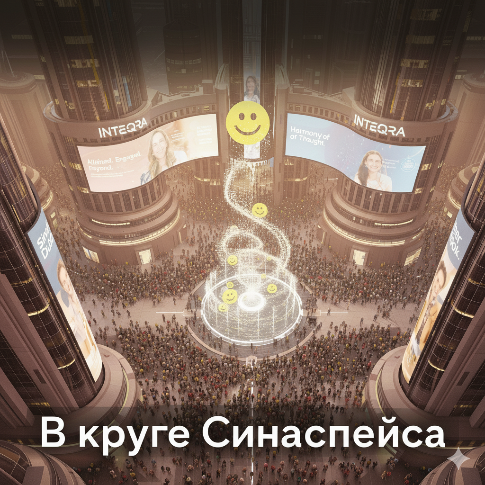

# В круге Синаспейса / Within the Circle of Synaspace

  

**Автор / Author:** Михаил Захаров / Mikhail Zakharov  
**Жанр / Genre:** Киберпанк / Антиутопия / Когнитивная реальность / Cyberpunk / Dystopia / Cognitive Reality  
**Язык / Language:** Русский / Russian / English translation

---
In the near future, where reality merges with the digital space of Synaspace and human perception is governed by a neural interface, everyday life has become a perfectly synchronized process. Society functions efficiently, harmoniously — and seemingly without flaws.

One ordinary morning, a single workday, and one evening gradually reveal subtle cracks in a system that governs not only behavior, but thought itself. What remains of a human being in a world where knowledge is replaced by skills, rules, and optimized patterns?

In the Circle of Synaspace is a short dystopian story about control, adaptation, and the quiet disintegration of reality — one that may not be as distant as it seems.

В ближайшем будущем, где реальность переплетается с цифровым пространством Синаспейса, а человеческое восприятие управляется нейроинтерфейсом, повседневная жизнь превратилась в идеально синхронизированный процесс. Общество функционирует эффективно, гармонично — и, на первый взгляд, безупречно.

Одно обычное утро, один рабочий день и один вечер постепенно обнажают тонкие трещины в системе, которая управляет не только поведением, но и мышлением. Что остаётся от человека в мире, где знания заменяются навыками, правилами и оптимизированными паттернами?

«В круге Синаспейса» — короткая антиутопическая проза о контроле, адаптации и тихом распаде реальности, которая, возможно, не так далека, как кажется.

---

Если вы хотите окунуться в необычный мир когнитивной реальности, исследовать тонкие грани свободы и контроля, этот текст — для вас.

---

### Disclaimer / Дисклеймер
All names, characters, organizations, brands, events, and concepts depicted in the Synaspace project are fictional.
Any resemblance to real persons, living or dead, or to actual companies or institutions is purely coincidental.
This work is a piece of fiction and does not intend to represent, reference, or be affiliated with any real-world entity.

Все имена, персонажи, организации, бренды, события и концепции, используемые в проекте «Синаспейс», являются вымышленными.
Любые совпадения с реальными людьми (живыми или умершими), компаниями или организациями являются случайными.
Произведение носит исключительно художественный характер и не имеет отношения к каким-либо реальным субъектам.
